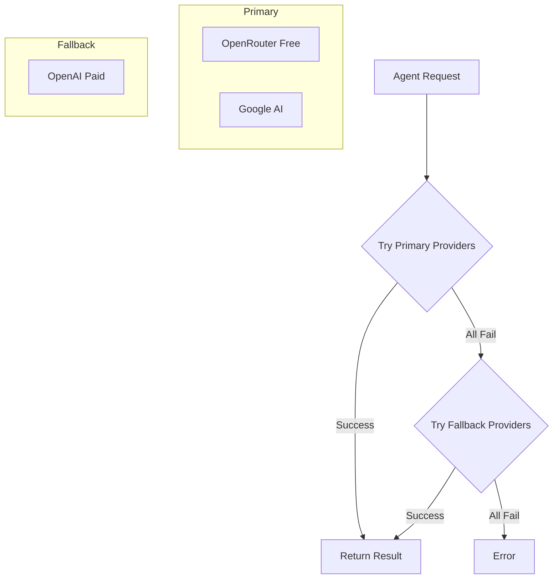

# Vanilla Agentic Framework

A universal, modern, and minimal agentic framework that supports multiple AI providers with intelligent fallback logic. Built with TypeScript and designed to be simple yet powerful.

## Features

- 🔄 **Smart Provider Fallback**: Primary providers (free models) with critical fallback to paid models
- 🛠️ **Tool Support**: Easy-to-define tools with automatic execution
- 🌐 **Multiple Providers**: OpenRouter, Google AI, and OpenAI support
- 📦 **Zero Dependencies**: Pure TypeScript implementation using only built-in APIs
- 🎯 **Type Safe**: Full TypeScript support with proper type definitions
- ⚡ **Minimal**: Clean, focused API without unnecessary complexity

## Quick Start

### Installation

```bash
# Clone the repository
git clone <repository-url>
cd vanilla-agentic-framework

# Install dependencies
npm install

# Build the project
npm run build
```

### Basic Usage

```typescript
import { defineTool, runAgent, ProviderConfig } from "./src/index.js";
import { openRouter, google, openai } from "./src/index.js";

// Define a simple tool
const calculatorTool = defineTool({
  name: "add",
  description: "Add two numbers together",
  parameters: {
    type: "object",
    properties: {
      a: { type: "number", description: "First number" },
      b: { type: "number", description: "Second number" },
    },
    required: ["a", "b"],
  },
  execute: async (args: { a: number; b: number }) => {
    return args.a + args.b;
  },
});

// Configure providers with fallback logic
const providers: ProviderConfig[] = [
  // Primary providers (free models)
  {
    p: openRouter,
    model: "meta-llama/llama-3.1-8b-instruct:free",
    priority: "primary",
  },
  {
    p: google,
    model: "models/gemini-2.0-flash-thinking-exp",
    priority: "primary",
  },

  // Fallback provider (paid model)
  { p: openai, model: "gpt-4o-mini", priority: "fallback" },
];

// Run the agent
const messages = [{ role: "user", content: "What is 15 + 27?" }];

const tools = { add: calculatorTool };

const result = await runAgent(messages, tools, providers);
console.log(result);
```

## Provider Configuration

### OpenRouter (Free Models)

```typescript
import { createOpenRouterProvider } from "./src/providers/openrouter.js";

const openRouter = createOpenRouterProvider("your-openrouter-api-key");
```

### Google AI (Custom Endpoint)

```typescript
import { createGoogleProvider } from "./src/providers/google.js";

const google = createGoogleProvider(
  "your-google-api-key",
  "https://ai-api.yoda.digital" // Custom base URL
);
```

### OpenAI (Fallback)

```typescript
import { createOpenAIProvider } from "./src/providers/openai.js";

const openai = createOpenAIProvider("your-openai-api-key");
```

## Fallback Logic

The framework implements a sophisticated fallback strategy:

1. **Primary Providers**: Free models from OpenRouter and Google AI
2. **Critical Fallback**: Paid OpenAI models when primary providers fail

This ensures cost-effective operation while maintaining reliability.



## Tool Definition

Tools are the core of the agentic framework. They allow AI models to perform actions and interact with external systems.

```typescript
const weatherTool = defineTool({
  name: "get_weather",
  description: "Get current weather for a location",
  parameters: {
    type: "object",
    properties: {
      location: {
        type: "string",
        description: "City name or coordinates",
      },
      units: {
        type: "string",
        enum: ["celsius", "fahrenheit"],
        description: "Temperature units",
      },
    },
    required: ["location"],
  },
  execute: async (args: { location: string; units?: string }) => {
    // Your weather API logic here
    return {
      location: args.location,
      temperature: 22,
      units: args.units || "celsius",
      condition: "sunny",
    };
  },
});
```

## API Reference

### Core Functions

#### `runAgent(messages, tools, providers, maxSteps?)`

Runs the agent with the specified configuration.

- `messages`: Array of chat messages
- `tools`: Object mapping tool names to tool definitions
- `providers`: Array of provider configurations with priorities
- `maxSteps`: Maximum number of agent steps (default: 8)

#### `defineTool(options)`

Defines a new tool for the agent.

- `name`: Tool name (must be unique)
- `description`: Tool description for the AI
- `parameters`: JSON Schema for tool parameters
- `execute`: Async function that executes the tool

### Provider Interfaces

#### `ProviderConfig`

```typescript
interface ProviderConfig {
  p: Provider; // Provider instance
  model: string; // Model name
  priority: "primary" | "fallback"; // Priority level
}
```

#### `ChatMessage`

```typescript
interface ChatMessage {
  role: "system" | "user" | "assistant" | "tool";
  content: string;
}
```

## Examples

### Math Agent

See [`src/examples/mathAgent.ts`](src/examples/mathAgent.ts) for a complete example that demonstrates:

- Multiple tool definitions (add, multiply, divide)
- Provider fallback configuration
- Error handling
- Step-by-step problem solving

Run the example:

```bash
npm run build
node dist/examples/mathAgent.js
```

## Configuration

### Environment Variables

You can set API keys via environment variables:

```bash
export OPENROUTER_API_KEY="your-key"
export GOOGLE_API_KEY="your-key"
export OPENAI_API_KEY="your-key"
```

### Custom Models

Each provider supports different models:

**OpenRouter Free Models:**

- `meta-llama/llama-3.1-8b-instruct:free`
- `microsoft/phi-3-mini-128k-instruct:free`
- `google/gemma-2-9b-it:free`

**Google AI Models:**

- `models/gemini-2.0-flash-thinking-exp`
- `models/gemini-1.5-pro`
- `models/gemini-1.5-flash`

**OpenAI Models:**

- `gpt-4o-mini`
- `gpt-4o`
- `gpt-3.5-turbo`

## Architecture

The framework follows a clean, modular architecture:

```
src/
├── core/
│   ├── Provider.ts      # Provider interfaces
│   ├── Tool.ts          # Tool definition utilities
│   ├── AgentRunner.ts   # Main agent logic
│   └── Stream.ts        # Streaming utilities
├── providers/
│   ├── openrouter.ts    # OpenRouter implementation
│   ├── google.ts        # Google AI implementation
│   └── openai.ts        # OpenAI implementation
├── examples/
│   └── mathAgent.ts     # Example implementation
└── index.ts             # Main exports
```

## Contributing

1. Fork the repository
2. Create a feature branch
3. Make your changes
4. Add tests if applicable
5. Submit a pull request

## License

MIT License - see LICENSE file for details.

## Support

For issues and questions:

- Create an issue on GitHub
- Check the examples directory for usage patterns
- Review the TypeScript definitions for API details
