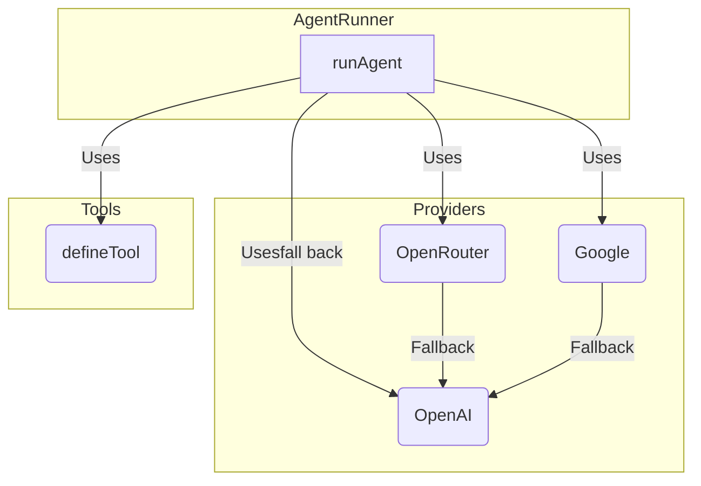

# Project Plan: Universal Agentic Framework

This document outlines the plan to build a universal, modern, and minimal agentic framework prototype.

## Phase 1: Core Implementation

1.  **`defineTool` Implementation:** Implement the `defineTool` function in `src/core/Tool.ts` to correctly wrap a function and its schema.
2.  **`AgentRunner` Implementation:** Implement the `runAgent` function in `src/core/AgentRunner.ts` to handle the main agent loop, including the specified fallback logic.

## Phase 2: Provider Implementation

3.  **OpenAI Provider:** Implement the OpenAI provider in `src/providers/openai.ts` to make API calls to OpenAI, including tool support.
4.  **Google Provider:** Implement the Google provider in `src/providers/google.ts` to make API calls to the Google Generative AI endpoint, including the custom base URL.
5.  **OpenRouter Provider:** Implement the OpenRouter provider in `src/providers/openrouter.ts` to make API calls to OpenRouter.

## Phase 3: Example and Testing

6.  **Update `mathAgent` Example:** Update the `src/examples/mathAgent.ts` to use the new framework and demonstrate the fallback functionality.
7.  **Create a `README.md`:** Create a comprehensive `README.md` with instructions on how to use the framework, including how to configure the different providers.

## Architecture Diagram

## API Keys and Endpoints

- **OpenAI API Key:** `YOUR_OPENAI_API_KEY`
- **OpenRouter API Key:** `YOUR_OPENROUTER_API_KEY`
- **Google API Key:** `YOUR_GOOGLE_API_KEY`
- **Google Base URL:** `https://ai-api.yoda.digital`
